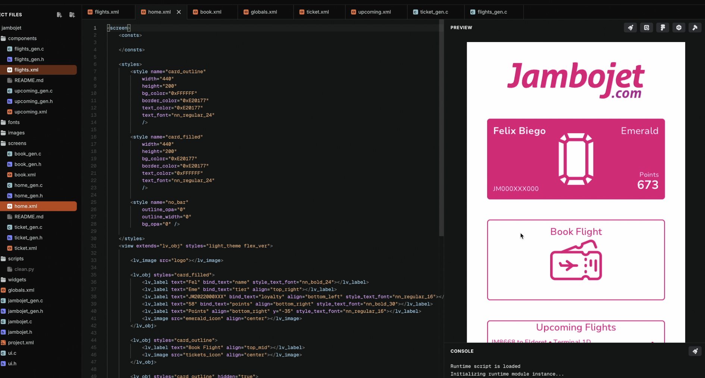
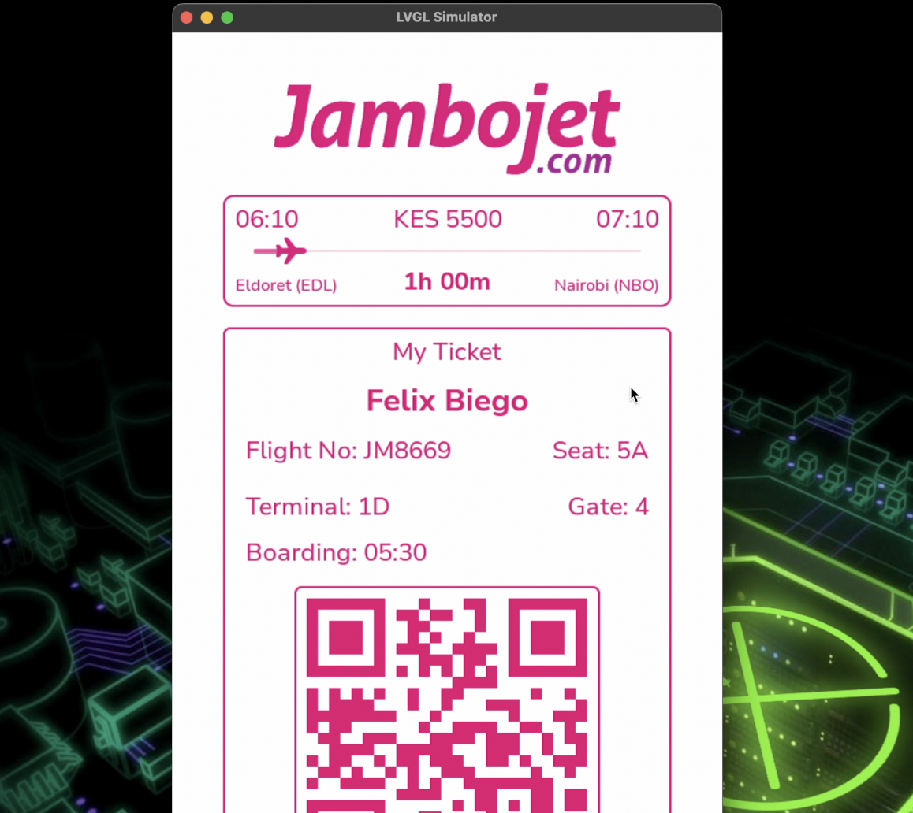
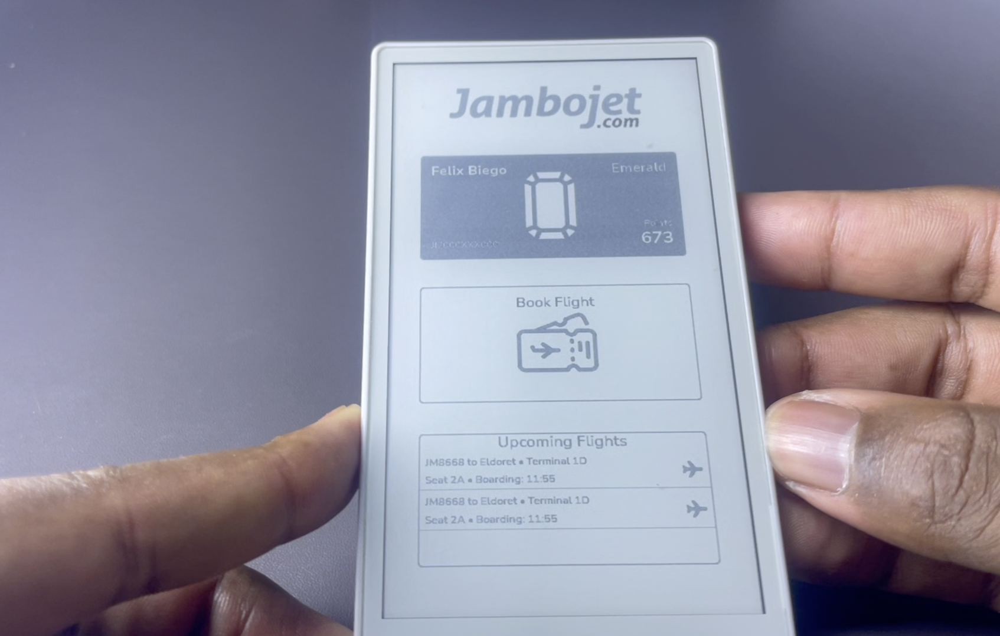

# Flight Ticket UI Demo
A simple UI designed with LVGL Editor (using the new XML support in LVGL v9.3), inspired by Kenya's [`Jambojet`](https://www.jambojet.com/). It features:

- Home screen (Loyalty points & upcoming flights)
- Booking screen
- Ticket screen with QR code

### LVGL Editor

[`LVGL Editor`](https://github.com/lvgl/lvgl_editor)

Open the folder [jmabojet](src/jambojet/) using LVGL Editor

### Hardware

[`M5 Paper S3`](https://shop.m5stack.com/products/m5papers3-esp32s3-development-kit)

### Screenshots

